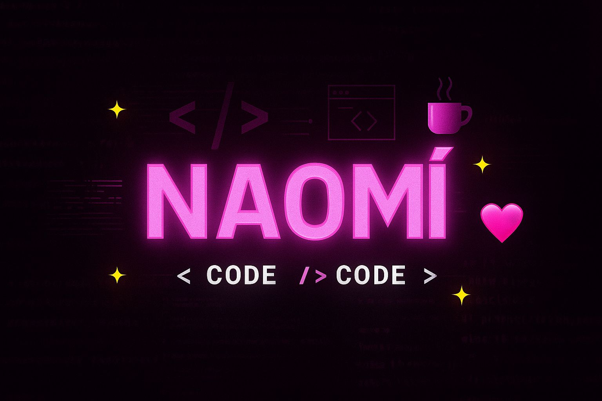

<h1 align="center">¡Hola! Soy Naomí 👋</h1>

✨ Estudiante de Análisis de Sistemas (antes Psicología)  
💻 Me gusta ayudar a las personas y crear cosas útiles con software  
🎨 Interesada en el diseño visual, UI/UX y la experiencia del usuario  
👗 Estoy trabajando en un sistema de tienda de ropa con Java  
📚 Aprendiendo Java, SQL y desarrollo web

### 📌 Tecnologías que estoy aprendiendo
- Java ☕
- SQL 🗃️
- HTML, CSS y diseño de interfaces 🎨

### 🛠️ Proyectos en los que estoy trabajando
- Sistema de tienda de ropa: gestión de productos, clientes y ventas  
- Interfaces gráficas con Java Swing

### 📫 ¿Querés contactarme?
- GitHub: [Naomimor](https://github.com/Naomimor)
